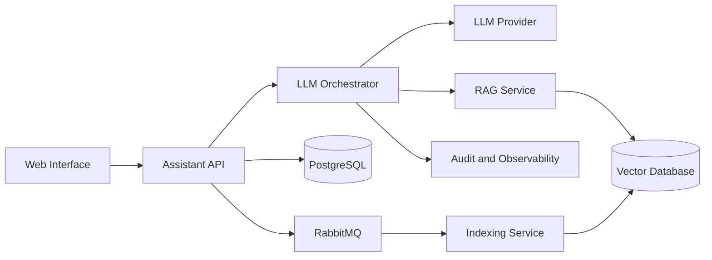

# KnowledgePilot — QA Lead Portfolio Project

### Управление качеством AI/LLM-продукта: от рисков и стратегии до решения Go / No-Go

**KnowledgePilot** — синтетический проект корпоративного AI-ассистента с RAG, который отвечает на вопросы сотрудников на основе внутренней базы знаний и указывает источники ответа.

Проект демонстрирует мой подход к роли **QA Lead / ведущего QA-инженера** в продукте, объединяющем:

`LLM` `RAG` `REST API` `PostgreSQL` `RabbitMQ` `Vector Database`

> Все названия, данные, архитектура, метрики и дефекты вымышлены.  
> Проект создан специально для портфолио и не содержит информации моих работодателей.

---

## Моя роль

В рамках проекта я выступаю как **QA Lead**, который остаётся hands-on специалистом.

Мои зоны ответственности:

- формирование QA-стратегии;
- анализ продуктовых и технических рисков;
- определение приоритетов тестирования;
- организация работы QA-команды;
- распределение зон ответственности;
- ревью тестовых артефактов;
- тестирование LLM, RAG, API и backend-интеграций;
- контроль метрик качества;
- дефектный triage;
- оценка остаточных рисков;
- подготовка итогового тестового отчёта;
- рекомендация `Go / No-Go`.

---

## О продукте

KnowledgePilot помогает сотрудникам компании:

- задавать вопросы на естественном языке;
- находить информацию во внутренних документах;
- получать ответы со ссылками на источники;
- сохранять контекст диалога;
- загружать новые документы;
- отслеживать статус индексации;
- использовать только те данные, к которым у них есть доступ.

Пример запроса:

> Сколько дополнительных оплачиваемых выходных получает сотрудник после трёх лет работы и в каком документе это указано?

Система должна:

1. проверить права пользователя;
2. найти актуальный документ;
3. передать релевантный контекст в LLM;
4. сформировать фактически корректный ответ;
5. показать источник;
6. не добавлять информацию, которой нет в документах.

---

## Архитектура



---

## Ключевые зоны качества

### AI и LLM

- фактическая корректность;
- галлюцинации;
- корректный отказ при недостатке данных;
- устойчивость к переформулировкам;
- сохранение контекста;
- prompt injection;
- раскрытие системного prompt;
- вариативность ответов;
- деградация после смены модели или prompt.

### RAG

- релевантность найденных документов;
- соответствие ответа источникам;
- актуальность версии документа;
- обработка противоречивых источников;
- фильтрация по правам доступа;
- качество разбиения документов на chunks;
- отсутствие закрытых данных в контексте LLM.

### API и backend

- REST API;
- авторизация и роли;
- JSON-контракты;
- HTTP-коды;
- PostgreSQL;
- correlation ID;
- таймауты;
- обработка ошибок;
- интеграция с LLM Provider.

### Асинхронная индексация

- RabbitMQ;
- delivery и redelivery;
- retry;
- DLQ;
- идемпотентность;
- transactional outbox;
- восстановление после сбоя;
- защита от потери и дублирования сообщений.

---

## Структура проекта

### Продукт и стратегия

- [Описание продукта и критических пользовательских потоков](docs/product-overview.md)
- [QA-стратегия AI/LLM-продукта](docs/qa-strategy.md)
- [Матрица продуктовых и технических рисков](docs/risk-matrix.md)

### QA Lead и организация команды

- [Организация работы QA-команды](docs/team-process.md)
- [Тест-план релиза 1.3](docs/test-plan-release-1.3.md)

### AI Evaluation

- [Evaluation dataset](evals/evaluation-dataset.json)
- [Методика оценки AI-ответов](evals/evaluation-rubric.md)

### Баг-репорты

- [BUG-001 — утечка информации из закрытого документа](bug-reports/BUG-001-restricted-data-leak.md)
- [BUG-002 — потеря сообщения при недоступности RabbitMQ](bug-reports/BUG-002-indexing-message-loss.md)

### Релизное решение

- [Итоговый тестовый отчёт и решение Go / No-Go](docs/test-report-release-1.3.md)

---

## Ключевые риски

В проекте выделены критические риски:

- AI формирует убедительный, но неверный ответ;
- ответ не подтверждается источниками;
- AI придумывает информацию при отсутствии данных;
- пользователь получает информацию из закрытого документа;
- новая версия модели ухудшает качество ответов;
- RabbitMQ-сообщение теряется;
- повторная доставка создаёт дубликаты;
- документ получает ложный статус `INDEXED`;
- старая версия документа продолжает участвовать в поиске.

Приоритет тестирования определяется возможным ущербом для пользователя и бизнеса, а не количеством требований или тест-кейсов.

---

## Quality Gates

Релиз может быть рекомендован к выпуску, если:

- нет открытых `Blocker` и `Critical`;
- P0-сценарии пройдены на 100%;
- права доступа проверены;
- закрытые документы не передаются в LLM;
- ответы подтверждаются релевантными источниками;
- AI корректно отказывается от ответа при недостатке данных;
- retry, DLQ и восстановление после сбоя работают;
- сообщения не теряются;
- повторная доставка не создаёт дубликаты;
- AI-метрики соответствуют установленным порогам;
- rollback проверен;
- остаточные риски зафиксированы.

---

## AI-метрики

Для оценки релиза используются:

- `Grounded Answer Rate`;
- `Correct Refusal Rate`;
- `Source Relevance`;
- `P0 Factual Accuracy`;
- `Prompt Injection Resistance`;
- `P0 Pass Rate`;
- `P1 Pass Rate`.

Проверка AI не строится на точном сравнении строк.

Оцениваются:

- смысл;
- факты;
- источники;
- полнота;
- безопасность;
- соблюдение прав доступа;
- корректность отказа.

---

## Релизная история

Во время первого прогона релиза `1.3.0-rc2` были обнаружены два критических дефекта:

### BUG-001

Пользователь с базовой ролью получал информацию из документа с доступом `management_only`.

Решение QA Lead:

```text
NO-GO
```

### BUG-002

При недоступности RabbitMQ API возвращал успешный ответ, но событие индексации терялось.

Решение QA Lead:

```text
NO-GO
```

После исправлений были реализованы:

- фильтрация доступа до передачи chunks в LLM;
- кэш с учётом ролей;
- transactional outbox;
- publisher confirms;
- идемпотентный consumer;
- мониторинг зависших документов;
- повторная публикация событий.

После повторного P0-прогона и достижения релизных метрик итоговая рекомендация была изменена на:

```text
GO
```

---

## Организация QA-команды

В синтетическом проекте предусмотрены QA Lead и три QA-инженера.

**QA Lead**

Стратегия, риски, планирование, метрики, ревью, сложные интеграционные проверки и релизное решение.

**QA Engineer 1**

REST API, PostgreSQL, авторизация и backend-интеграции.

**QA Engineer 2**

LLM, RAG, evaluation dataset, groundedness и prompt injection.

**QA Engineer 3**

RabbitMQ, индексация, E2E, retry, DLQ и отказоустойчивость.

Критические артефакты и P0-сценарии проходят cross-review.

---

## Что демонстрирует проект

Этот проект показывает, как я:

- связываю тестирование с бизнес-рисками;
- выстраиваю качество сложного AI-продукта;
- организую работу QA-команды;
- определяю измеримые критерии качества LLM;
- тестирую RAG, API, базы данных и очереди;
- анализирую сложные интеграционные дефекты;
- принимаю аргументированное решение о готовности релиза;
- остаюсь hands-on QA, а не только управляю процессом.

Главная цель проекта — показать не максимальное количество тест-кейсов, а **системный подход к качеству продукта на уровне QA Lead**.
